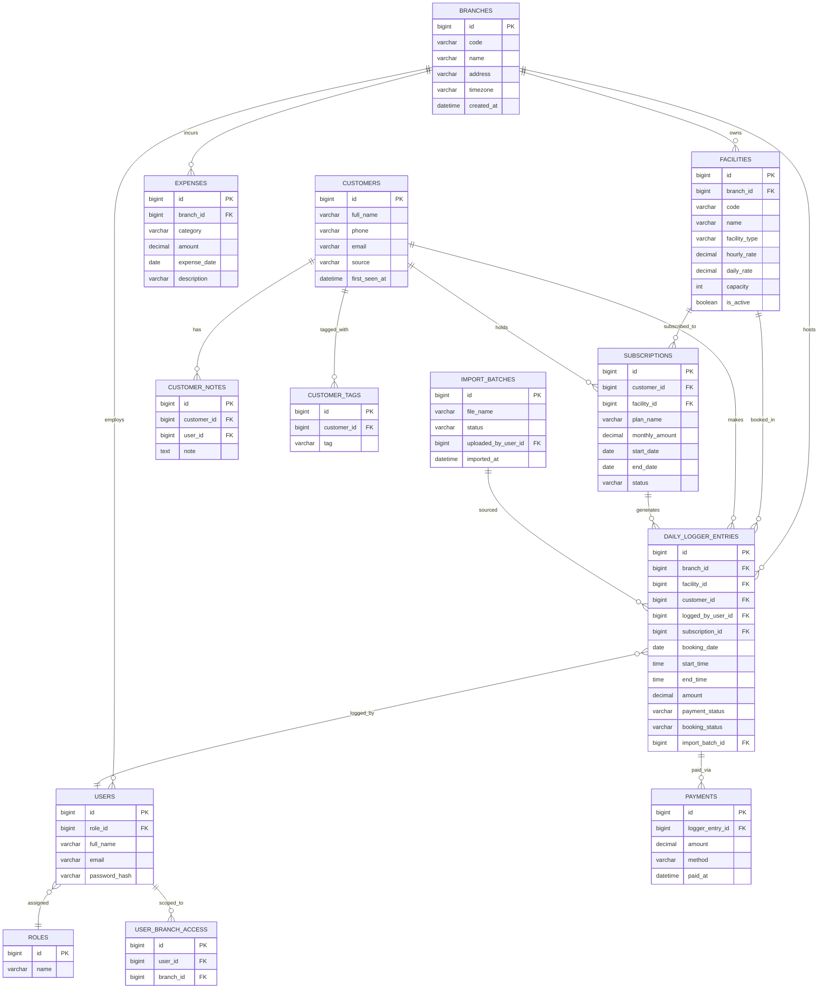
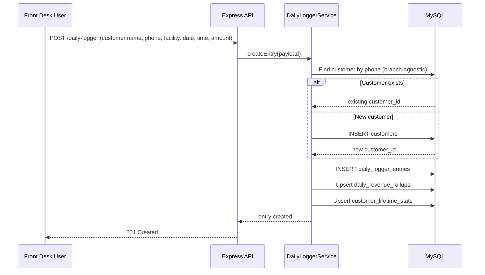
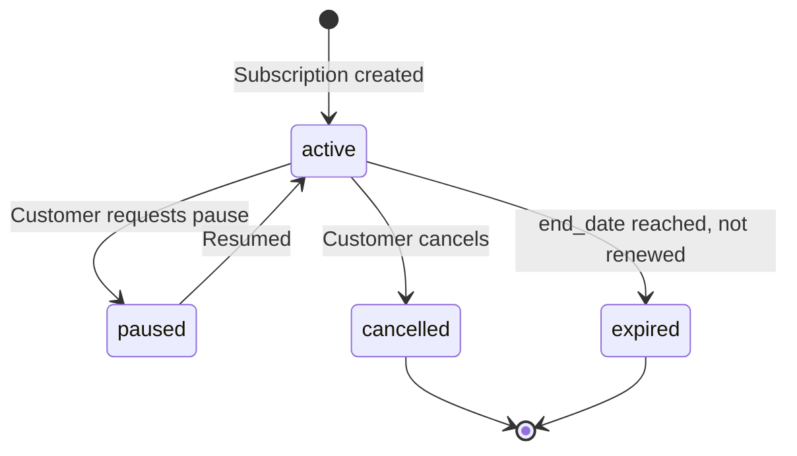

# DATABASE_ARCHITECTURE.md

**Project:** Workspace Management ERP + CRM
**Document Type:** Relational Database Architecture
**Database Engine:** MySQL 8.x (managed via phpMyAdmin, hosted on Hostinger)
**Audience:** Backend Engineers, Database Administrators

> The Daily Logger table set is the gravitational center of this schema. Every other table either feeds it (branches, facilities, customers) or is derived from it (CRM aggregates, dashboard rollups, reports). Read this document alongside PROJECT_RULES.md Section 8 (Database Rules) before writing any migration.

---

## Table of Contents

1. Design Philosophy & Normalization Approach
2. Entity Relationship Diagram
3. Core Tables
4. Relationships & Keys
5. Indexes
6. Naming Conventions
7. Migration Strategy
8. Excel Mapping
9. Import Wizard Strategy
10. Booking Flow
11. Revenue Calculation
12. Expense Calculation
13. Subscription Logic
14. CRM Relationships
15. Audit Logs
16. Soft Deletes
17. Data Validation Rules
18. Optimization
19. Future Scalability
20. Backup Strategy

---

## 1. Design Philosophy & Normalization Approach

- Schema is normalized to **3NF** for transactional tables (branches, facilities, daily_logger_entries, customers, subscriptions, expenses).
- **Denormalized rollup tables** are deliberately introduced for BI/dashboard performance (`daily_revenue_rollups`, `customer_lifetime_stats`) — these are explicitly documented as derived/cache tables, never treated as sources of truth, and are always rebuildable from the Daily Logger tables.
- Every transactional table carries `created_at`, `updated_at`, `deleted_at` (soft delete) unless explicitly noted.
- All monetary columns are `DECIMAL(12,2)`. All timestamps are `DATETIME` stored in UTC.

---

## 2. Entity Relationship Diagram



---

## 3. Core Tables

### 3.1 `branches`

| Column | Type | Notes |
|---|---|---|
| `id` | BIGINT UNSIGNED PK AI | |
| `code` | VARCHAR(20) UNIQUE | e.g. `ATH`, `HIVE` |
| `name` | VARCHAR(150) | e.g. "Art & Tech Hub" |
| `address` | VARCHAR(255) | |
| `timezone` | VARCHAR(50) | e.g. `Africa/Lagos` |
| `is_active` | BOOLEAN DEFAULT TRUE | |
| `created_at`, `updated_at`, `deleted_at` | DATETIME | |

### 3.2 `facilities`

| Column | Type | Notes |
|---|---|---|
| `id` | BIGINT UNSIGNED PK AI | |
| `branch_id` | BIGINT UNSIGNED FK → branches.id | |
| `code` | VARCHAR(30) UNIQUE | e.g. `HIVE-CONF-01` |
| `name` | VARCHAR(150) | e.g. "Conference Room" |
| `facility_type` | VARCHAR(50) | co-working, meeting_room, conference_room, private_office, training_room, podcast_room, executive_office, event_space, other |
| `hourly_rate` | DECIMAL(12,2) NULL | |
| `daily_rate` | DECIMAL(12,2) NULL | |
| `capacity` | INT NULL | |
| `is_active` | BOOLEAN DEFAULT TRUE | |
| `created_at`, `updated_at`, `deleted_at` | DATETIME | |

**Rule:** `facility_type` is an open, extensible string (validated against a maintained lookup list in application code), not a rigid ENUM — new facility types (e.g., "Football Field", "Public Address System" as seen at Hive Hub) must be addable without a schema migration.

### 3.3 `customers`

| Column | Type | Notes |
|---|---|---|
| `id` | BIGINT UNSIGNED PK AI | |
| `full_name` | VARCHAR(150) | |
| `phone` | VARCHAR(30) | Indexed, used for dedupe matching |
| `email` | VARCHAR(150) NULL | |
| `source` | VARCHAR(30) | `daily_logger` \| `import` |
| `first_seen_at` | DATETIME | First Daily Logger appearance |
| `created_at`, `updated_at`, `deleted_at` | DATETIME | |

**Rule (enforced in service layer, not DB constraint):** No row in `customers` may be created except by the Daily Logger entry creation service or the Import Wizard service. See Section 14.

### 3.4 `daily_logger_entries` (the heart of the schema)

| Column | Type | Notes |
|---|---|---|
| `id` | BIGINT UNSIGNED PK AI | |
| `branch_id` | BIGINT UNSIGNED FK → branches.id | |
| `facility_id` | BIGINT UNSIGNED FK → facilities.id | |
| `customer_id` | BIGINT UNSIGNED FK → customers.id | |
| `logged_by_user_id` | BIGINT UNSIGNED FK → users.id | |
| `subscription_id` | BIGINT UNSIGNED NULL FK → subscriptions.id | Set if entry was auto-generated from a subscription |
| `booking_date` | DATE | |
| `start_time` | TIME NULL | |
| `end_time` | TIME NULL | |
| `amount` | DECIMAL(12,2) | Revenue attributed to this entry |
| `payment_status` | VARCHAR(20) | `paid` \| `partial` \| `unpaid` |
| `booking_status` | VARCHAR(20) | `confirmed` \| `completed` \| `cancelled` \| `no_show` |
| `notes` | VARCHAR(500) NULL | |
| `import_batch_id` | BIGINT UNSIGNED NULL FK → import_batches.id | |
| `source_row_number` | INT NULL | Traceability to original Excel row |
| `source_sheet_name` | VARCHAR(100) NULL | |
| `created_at`, `updated_at`, `deleted_at` | DATETIME | |

### 3.5 `payments`

| Column | Type | Notes |
|---|---|---|
| `id` | BIGINT UNSIGNED PK AI | |
| `logger_entry_id` | BIGINT UNSIGNED FK → daily_logger_entries.id | |
| `amount` | DECIMAL(12,2) | |
| `method` | VARCHAR(30) | cash, transfer, card, pos |
| `paid_at` | DATETIME | |

A single logger entry may have multiple partial payments; `payment_status` on the entry is derived from the sum of its `payments`.

### 3.6 `subscriptions`

| Column | Type | Notes |
|---|---|---|
| `id` | BIGINT UNSIGNED PK AI | |
| `customer_id` | BIGINT UNSIGNED FK → customers.id | |
| `facility_id` | BIGINT UNSIGNED FK → facilities.id | |
| `plan_name` | VARCHAR(100) | e.g. "Monthly Co-working — Individual" |
| `monthly_amount` | DECIMAL(12,2) | |
| `billing_cycle` | VARCHAR(20) | monthly, quarterly, annual |
| `start_date` | DATE | |
| `end_date` | DATE NULL | |
| `status` | VARCHAR(20) | active, paused, cancelled, expired |
| `created_at`, `updated_at`, `deleted_at` | DATETIME | |

### 3.7 `expenses`

| Column | Type | Notes |
|---|---|---|
| `id` | BIGINT UNSIGNED PK AI | |
| `branch_id` | BIGINT UNSIGNED FK → branches.id | |
| `category` | VARCHAR(50) | rent, utilities, salaries, maintenance, marketing, other |
| `amount` | DECIMAL(12,2) | |
| `expense_date` | DATE | |
| `description` | VARCHAR(255) NULL | |
| `created_at`, `updated_at`, `deleted_at` | DATETIME | |

### 3.8 `users`, `roles`, `user_branch_access`

| Table | Key Columns |
|---|---|
| `roles` | `id`, `name` (Super Admin, Branch Manager, Front Desk, Finance, Viewer) |
| `users` | `id`, `role_id` FK, `full_name`, `email` UNIQUE, `password_hash`, `is_active` |
| `user_branch_access` | `id`, `user_id` FK, `branch_id` FK — many-to-many scoping of non-Super-Admin users to branches |

### 3.9 `import_batches`

| Column | Type | Notes |
|---|---|---|
| `id` | BIGINT UNSIGNED PK AI | |
| `file_name` | VARCHAR(255) | |
| `status` | VARCHAR(20) | pending, validated, imported, failed, rolled_back |
| `total_rows` | INT | |
| `imported_rows` | INT | |
| `error_rows` | INT | |
| `uploaded_by_user_id` | BIGINT UNSIGNED FK → users.id | |
| `imported_at` | DATETIME NULL | |
| `created_at` | DATETIME | |

### 3.10 `customer_notes` / `customer_tags`

Simple child tables allowing CRM enrichment without touching the customer's derived statistics.

### 3.11 Derived / Rollup Tables (Cache Layer — Rebuildable)

| Table | Purpose | Refresh |
|---|---|---|
| `daily_revenue_rollups` | branch_id, facility_id, date, total_revenue, total_bookings | Nightly job + real-time upsert on entry create |
| `customer_lifetime_stats` | customer_id, total_spend, total_visits, last_visit_date, favorite_facility_id | Recomputed on each Daily Logger write affecting that customer |
| `monthly_branch_summary` | branch_id, year_month, revenue, expenses, net, occupancy_rate | Nightly job |

**Rule:** Every rollup table has a documented rebuild script (`scripts/rebuild-rollups.ts`) that recomputes it entirely from source tables — this is the disaster-recovery and correctness guarantee for all derived data.

---

## 4. Relationships & Keys

| Relationship | Type | Enforcement |
|---|---|---|
| Branch → Facilities | 1:N | FK `facilities.branch_id`, `ON DELETE RESTRICT` |
| Facility → Daily Logger Entries | 1:N | FK, `ON DELETE RESTRICT` |
| Customer → Daily Logger Entries | 1:N | FK, `ON DELETE RESTRICT` |
| Daily Logger Entry → Payments | 1:N | FK, `ON DELETE CASCADE` (payments are meaningless without the entry) |
| Customer → Subscriptions | 1:N | FK, `ON DELETE RESTRICT` |
| Subscription → Daily Logger Entries | 1:N (optional) | FK nullable, `ON DELETE SET NULL` |
| User → Role | N:1 | FK, `ON DELETE RESTRICT` |
| User ↔ Branch | N:N | Junction table `user_branch_access` |
| Import Batch → Daily Logger Entries | 1:N | FK nullable, `ON DELETE SET NULL` (preserves entries if batch record is pruned) |

**Rule:** `ON DELETE RESTRICT` is the default for all core foreign keys — nothing that has ever generated revenue can be silently cascade-deleted. Soft delete (Section 16) is the sanctioned removal mechanism.

---

## 5. Indexes

| Table | Index | Reason |
|---|---|---|
| `daily_logger_entries` | `(branch_id, booking_date)` | Dashboard/report date-range queries per branch |
| `daily_logger_entries` | `(facility_id, booking_date)` | Facility occupancy queries |
| `daily_logger_entries` | `(customer_id)` | CRM booking history lookups |
| `daily_logger_entries` | `(import_batch_id)` | Import audit/rollback |
| `customers` | `(phone)` | Dedupe matching during import & new-entry creation |
| `subscriptions` | `(status, end_date)` | Renewal/expiry dashboard widgets |
| `expenses` | `(branch_id, expense_date)` | Financial reports |
| `daily_revenue_rollups` | `(branch_id, facility_id, date)` UNIQUE | Upsert target for rollup job |

---

## 6. Naming Conventions

See PROJECT_RULES.md Section 10 for the canonical table. Database-specific additions:

- All FK columns named `<singular_referenced_table>_id` (e.g., `branch_id`, `facility_id`).
- Junction tables named `<table_a>_<table_b>` alphabetically where no clearer name exists (e.g., `user_branch_access` is preferred over a generic `user_branches` for clarity of intent).
- Boolean columns prefixed `is_`/`has_` (`is_active`, `has_arrears`).

---

## 7. Migration Strategy

- Migrations are timestamped, forward-only files (`YYYYMMDDHHmmss_description.sql` or Knex/Prisma migration format per chosen ORM).
- **Expand-Migrate-Contract pattern** for breaking changes: add new column/table (expand) → backfill and dual-write (migrate) → remove old column in a later, separate migration (contract). Never a single migration that both adds and drops in a way that risks data loss without a tested rollback.
- Every migration that touches `daily_logger_entries` must be tested against an anonymized copy of production-scale data before merging, given its centrality.
- Rollback script required for every migration (`down()` function or explicit reverse SQL file).

---

## 8. Excel Mapping

The historical Excel workbook structure (one sheet per branch/month, typically containing columns like Date, Customer Name, Phone, Facility, Time In, Time Out, Amount, Payment Status) maps as follows:

| Excel Column (typical) | Target Table.Column |
|---|---|
| Date | `daily_logger_entries.booking_date` |
| Customer Name | `customers.full_name` (matched/created) |
| Phone Number | `customers.phone` (dedupe key) |
| Facility / Room | `facilities.name` → resolved to `facility_id` via branch-scoped lookup |
| Time In / Time Out | `daily_logger_entries.start_time` / `end_time` |
| Amount / Fee | `daily_logger_entries.amount` |
| Payment Status | `daily_logger_entries.payment_status` (normalized: "Paid"/"paid"/"PAID" → `paid`) |
| Sheet name / Row # | `source_sheet_name`, `source_row_number` (traceability only) |

**Rule:** Facility name matching during import is **branch-scoped** — "Conference Room" in an Art & Tech Hub sheet must never be matched to "Conference Room" at Hive Hub. The Import Wizard requires the operator to confirm which branch a sheet belongs to before row-level mapping begins.

---

## 9. Import Wizard Strategy

```mermaid
flowchart TD
    A[Upload Excel/CSV file] --> B[Create import_batches row, status=pending]
    B --> C[Parse sheet(s), detect columns]
    C --> D[Operator confirms branch + column mapping]
    D --> E[Validation pass: dates, amounts, duplicate detection]
    E -- errors found --> F[Show error rows for operator review/correction]
    F --> D
    E -- clean --> G[Preview screen: N rows to import]
    G --> H[Operator confirms import]
    H --> I[Batch insert into daily_logger_entries + customer matching/creation]
    I --> J[status=imported, trigger rollup recompute for affected date ranges]
```

- Import is **transactional per batch** — if the batch insert fails partway, the whole batch rolls back (MySQL transaction), leaving `import_batches.status = failed`.
- A completed batch can be explicitly rolled back by a Super Admin (soft-deletes all entries tied to that `import_batch_id` and recomputes affected rollups).

---

## 10. Booking Flow



---

## 11. Revenue Calculation

- **Booking-level revenue** = `daily_logger_entries.amount` (net of any documented discount already applied at entry time).
- **Facility revenue (period)** = `SUM(amount) WHERE facility_id = ? AND booking_date BETWEEN ? AND ? AND booking_status != 'cancelled'`.
- **Branch revenue (period)** = same, grouped by `branch_id`.
- Cancelled/no-show bookings are **excluded** from revenue but retained in the table (never deleted) for demand-analytics purposes (e.g., cancellation-rate reporting).
- Rollup tables (`daily_revenue_rollups`) pre-aggregate this exact calculation nightly plus real-time upsert on write, so dashboard load never scans raw `daily_logger_entries` for large date ranges.

---

## 12. Expense Calculation

- **Branch net (period)** = `SUM(daily_logger_entries.amount) − SUM(expenses.amount)` for the same branch and period, computed in the Reports service and cached in `monthly_branch_summary`.
- Expense categories are fixed (rent, utilities, salaries, maintenance, marketing, other) to keep cross-branch comparison meaningful; a "custom category" free-text field is available but always rolls up under `other` for aggregate charts.

---

## 13. Subscription Logic

- A `subscriptions` row represents a recurring commercial agreement (e.g., monthly co-working seat).
- A scheduled job (`generateSubscriptionEntries`) runs daily and, for each active subscription whose billing cycle indicates a charge is due, creates the corresponding `daily_logger_entries` row with `subscription_id` set — **this is the only path that creates a Daily Logger entry without direct front-desk action**, and it is clearly flagged in the UI (e.g., a small "Auto (Subscription)" badge) so front desk staff never confuse it with a walk-in booking.
- Subscription status transitions (`active → paused/cancelled/expired`) are logged in the audit trail (Section 15).



---

## 14. CRM Relationships

- `customers` rows are created **only** by: (a) the Daily Logger entry creation service, when no matching phone number exists, or (b) the Import Wizard, during batch processing.
- CRM-visible fields (`total_spend`, `total_visits`, `last_visit_date`, `favorite_facility_id`) live in `customer_lifetime_stats`, a derived table, recomputed whenever a related `daily_logger_entries` row is created/updated/soft-deleted for that customer.
- Editable CRM content (`customer_notes`, `customer_tags`) is the only user-writable surface — enforced at the API layer by simply not exposing a "create customer" or "edit spend" endpoint at all.
- **Customer Merge:** When two `customers` rows are identified as duplicates (e.g., imported under slightly different phone formatting), a Super Admin/Branch Manager can trigger a merge: all `daily_logger_entries.customer_id` and `subscriptions.customer_id` referencing the "loser" record are repointed to the "survivor" record inside a transaction, the loser record is soft-deleted, and a `merge_logs` entry (survivor_id, loser_id, merged_by, merged_at) is written for auditability.

---

## 15. Audit Logs

A dedicated `audit_logs` table records sensitive mutations:

| Column | Type | Notes |
|---|---|---|
| `id` | BIGINT UNSIGNED PK AI | |
| `user_id` | BIGINT UNSIGNED FK → users.id | Actor |
| `action` | VARCHAR(50) | `create`, `update`, `delete`, `merge`, `import`, `rollback` |
| `entity_type` | VARCHAR(50) | e.g. `daily_logger_entries`, `customers`, `subscriptions` |
| `entity_id` | BIGINT UNSIGNED | |
| `before_state` | JSON NULL | Snapshot before change |
| `after_state` | JSON NULL | Snapshot after change |
| `created_at` | DATETIME | |

Audited actions: any Daily Logger entry mutation, customer merges, subscription status changes, imports/rollbacks, role/permission changes. This table is append-only — no updates or deletes permitted on `audit_logs` itself.

---

## 16. Soft Deletes

- Every core table includes `deleted_at DATETIME NULL`. A non-null value marks the row as deleted.
- All repository-layer queries include `WHERE deleted_at IS NULL` by default via a shared query builder helper — engineers do not hand-write this clause per query (reduces risk of forgetting it).
- Hard deletes are never performed on `daily_logger_entries`, `customers`, `payments`, `subscriptions`, or `expenses` — financial/historical integrity is non-negotiable. Hard delete is permitted only for genuinely transient data (e.g., expired password-reset tokens).

---

## 17. Data Validation Rules

- `amount` fields: must be ≥ 0, max 2 decimal places, enforced both at the Zod schema layer and the `DECIMAL(12,2)` column type.
- `booking_date` cannot be more than 1 year in the future (configurable) — prevents fat-finger data entry.
- `phone` normalized to E.164-ish format before dedupe matching (strip spaces/dashes, retain country code) — done in a shared `normalizePhone()` utility used identically by both the Daily Logger creation flow and the Import Wizard.
- `facility_id` and `branch_id` on a `daily_logger_entries` row must be consistent (`facility.branch_id === entry.branch_id`) — enforced in the service layer with a validation check, since MySQL cannot express this cross-table constraint natively.

---

## 18. Optimization

- Composite indexes (Section 5) targeted specifically at the query patterns used by Dashboard and Reports (branch + date range being the dominant access pattern).
- `EXPLAIN` review is part of the Production Checklist (PROJECT_RULES.md Section 32) for any new report/dashboard query.
- Read replicas are a documented future option (Section 19) once reporting query volume grows large enough to contend with transactional writes on the primary.
- Rollup tables (Section 3.11) exist specifically to avoid full-table scans of `daily_logger_entries` for anything beyond single-day/single-facility lookups.

---

## 19. Future Scalability

- **Partitioning:** `daily_logger_entries` may be partitioned by `booking_date` (yearly ranges) once table size passes several million rows — schema is designed so this can be introduced without an application-layer change.
- **Read Replica:** Reports/Dashboard read traffic can be pointed at a MySQL read replica once write contention becomes measurable, since all report queries already go through a dedicated repository layer that can be swapped to a replica connection.
- **Multi-currency:** Current schema assumes single-currency operation; a future `currency` column on `branches` and `daily_logger_entries` plus an FX-rate table is the documented extension path if the business expands to multi-country operation.
- **Microservice extraction:** If the Import/Reporting workload grows heavy enough to warrant isolation, the modular folder structure (PROJECT_RULES.md Section 4) and the fact that rollups are already computed via discrete jobs make it straightforward to extract those into a separate worker service without changing the core schema.

---

## 20. Backup Strategy

- **Automated daily full backups** of the MySQL database via Hostinger's backup tooling, retained for a minimum of 30 days.
- **Pre-migration backups:** a manual/scripted backup is taken immediately before any production migration runs (see PROJECT_RULES.md Production Checklist).
- **Pre-import backups:** every Import Wizard batch run in production triggers an automatic point-in-time backup snapshot before the batch insert executes, given the volume of historical data involved and the higher risk of operator error during migration from Excel.
- Backups are periodically test-restored to a staging environment (quarterly minimum) to verify restore integrity, not just backup completion.

---

*End of DATABASE_ARCHITECTURE.md*